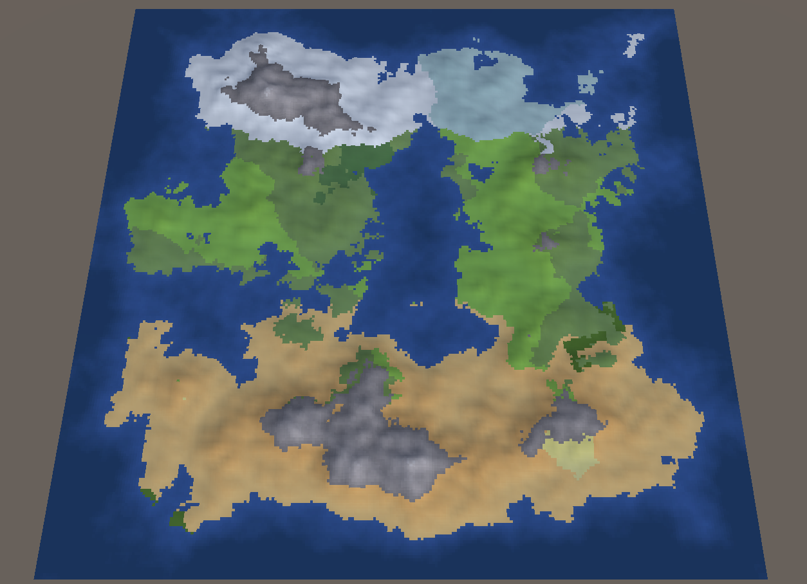

# RealmGen

A WIP procedural world generator in Unity.

Heightmap, wind, moisture & temperature used to generate climates.

Inspired by [Dwarf Fortress](http://www.bay12games.com/dwarves/) among others.
